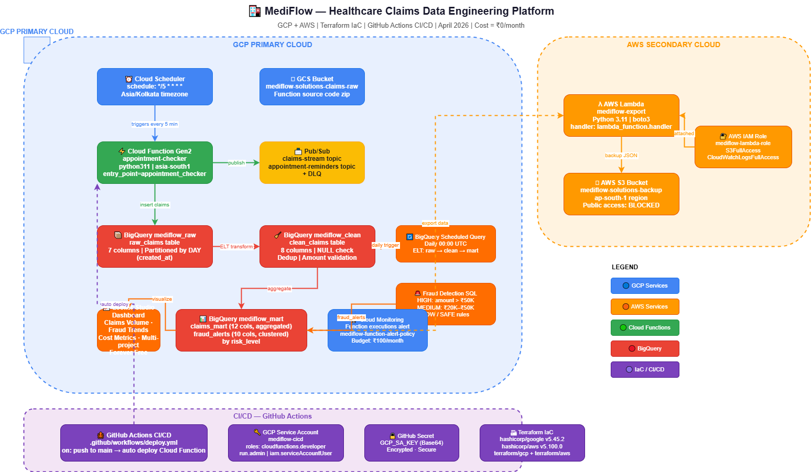

# MediFlow — Healthcare Claims Data Engineering Platform


## Overview

MediFlow is a multi-cloud Healthcare Claims Data Engineering platform built on GCP + AWS using Terraform IaC. It ingests, processes, and analyzes healthcare claims data with fraud detection — all within free tier limits.

## Architecture# mediflow-backend

Cloud Scheduler (every 5 min)
↓
Cloud Function Gen2 (appointment-checker)
↓
Pub/Sub (claims-stream)
↓
BigQuery Raw (mediflow_raw.raw_claims)
↓
BigQuery ELT → Clean → Mart
↓
Fraud Detection (HIGH / MEDIUM / LOW)
↓
Looker Studio Dashboard
↓
AWS Lambda → S3 Backup (multi-cloud)
## Tech Stack

| Layer | Technology |
|-------|-----------|
| Infrastructure | Terraform (GCP + AWS) |
| Ingestion | Cloud Functions Gen2 + Cloud Scheduler |
| Streaming | Pub/Sub → BigQuery Subscription |
| Storage | BigQuery (raw + clean + mart) |
| ELT | BigQuery Scheduled Queries (SQL) |
| Fraud Detection | BigQuery SQL Rules (HIGH/MEDIUM/LOW) |
| Dashboard | Looker Studio |
| Multi-cloud Backup | AWS S3 + Lambda |
| CI/CD | GitHub Actions |
| Monitoring | Cloud Monitoring + Budget Alerts |

## Project Structure
mediflow-backend/
├── terraform/
│   ├── gcp/          # GCP infrastructure (BigQuery, Functions, PubSub)
│   └── aws/          # AWS infrastructure (S3, Lambda)
├── functions/
│   └── appointment_checker/  # Cloud Function Gen2
│       ├── main.py
│       └── requirements.txt
├── pipelines/
│   ├── ingest/       # Data ingestion scripts
│   ├── sql/          # ELT SQL transforms
│   └── export/       # AWS Lambda export
└── .github/
└── workflows/
└── deploy.yml  # CI/CD pipeline
## Setup Instructions

### Prerequisites
- GCP Project with billing enabled
- AWS Account (free tier)
- Terraform >= 1.0
- Python 3.11
- gcloud CLI + AWS CLI configured

### GCP Setup
```bash
cd terraform/gcp
terraform init
terraform plan
terraform apply
```

### AWS Setup
```bash
cd terraform/aws
terraform init
terraform plan
terraform apply
# After verification:
terraform destroy  # to avoid charges
```

### CI/CD Setup
1. Create GCP Service Account with `cloudfunctions.developer` + `run.admin` roles
2. Add `GCP_SA_KEY` secret to GitHub Repository Secrets (Base64 encoded JSON)
3. Every push to `main` → auto deploys Cloud Function

## Pipeline Flow

1. **Cloud Scheduler** triggers Cloud Function every 5 minutes
2. **Cloud Function** generates random healthcare claims → publishes to Pub/Sub
3. **Pub/Sub** streams data directly into BigQuery `mediflow_raw.raw_claims`
4. **BigQuery ELT** transforms raw → clean → mart (scheduled daily)
5. **Fraud Detection** classifies claims: HIGH (>₹50,000), MEDIUM (duplicate), LOW (invalid diagnosis)
6. **Looker Studio** visualizes claims volume, fraud trends, cost metrics
7. **AWS Lambda** exports data to S3 as daily backup (multi-cloud)

## BigQuery Schema

| Dataset | Table | Purpose |
|---------|-------|---------|
| mediflow_raw | raw_claims | Raw ingested claims (partitioned by date) |
| mediflow_clean | clean_claims | Validated + normalized claims |
| mediflow_mart | claims_mart | Aggregated analytics |
| mediflow_mart | fraud_alerts | Fraud risk classifications |

## Cost

| Service | Usage | Cost |
|---------|-------|------|
| BigQuery | <1GB storage, <1TB queries | ₹0 |
| Cloud Functions | <100 invocations/day | ₹0 |
| Pub/Sub | Test messages only | ₹0 |
| Cloud Scheduler | 1 job | ₹0 |
| Looker Studio | Live dashboard | ₹0 |
| AWS S3 + Lambda | <100MB backup | ₹0 |
| **Total** | | **₹0/month** |

## Author

**Krishnan KC** — Data Engineer
- GitHub: [@krishnancloud-KC](https://github.com/krishnancloud-KC)
- Built: April 2026


